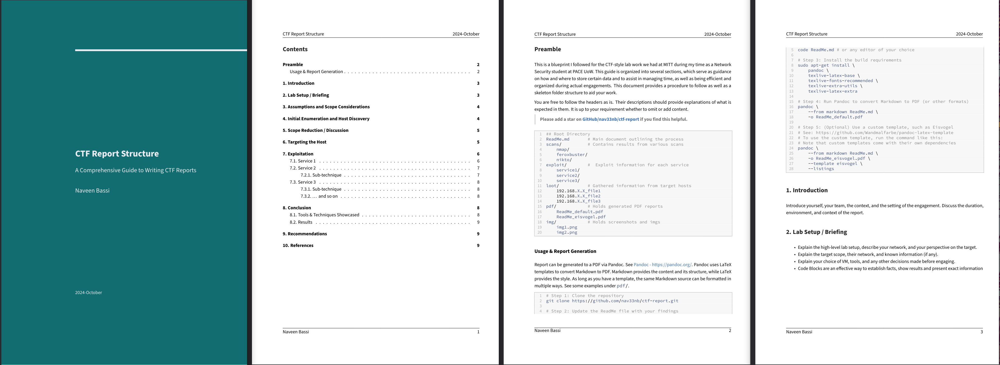
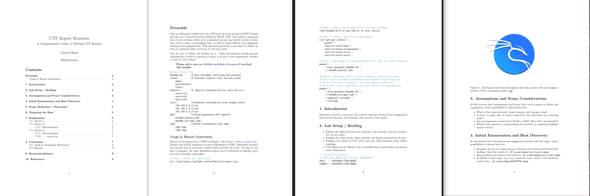

---
#This is report Metasata, essentially arguments passed on to pandoc
#during report generation used by latex template
title: "CTF Report Structure"
subtitle: "A Comprehensive Guide to Writing CTF Reports"
author: Naveen Bassi
date: "2024-October"
titlepage: "true"
titlepage-color: "126D71"
titlepage-text-color: "ECEDF2"
titlepage-rule-color: "ECEDF2"
titlepage-rule-height: 4
toc: "true"
toc-own-page: "true"
footer-left: "Naveen Bassi"
colorlinks: true
linkcolor: blue
# highlight-style: haddock
listings: true
...

# Preamble
This is a blueprint I followed for the CTF-style lab work we had at MITT during my time as a Network Security student at PACE UoW. This guide is organized into several sections, which serve as guidance on how and where to store certain data and to assist in managing time, as well as being efficient and organized during actual engagements. This document provides a procedure to follow as well as a skeleton folder structure to aid your work.

You are free to follow the headers as is. Their descriptions should provide explanations of what is expected in them. It is up to your requirement whether to omit or add content.

> **Please add a star on [GitHub/nav33nb/ctf-report](https://github.com/nav33nb/ctf-report) if you find this helpful.**





## Repository Structure

```sh
## Root Directory
ReadMe.md       # Main document outlining the process
scans/          # Contains results from various scans
    nmap/       
    feroxbuster/
    nikto/
exploit/        #  Exploit information for each service
    service1/
    service2/
    service3/
loot/           # Gathered information from target hosts
    192.168.X.X_file1
    192.168.X.X_file2
    192.168.X.X_file3
pdf/            # Holds generated PDF reports
    ReadMe_default.pdf
    ReadMe_eisvogel.pdf
img/            # Holds screenshots and imgs
    img1.png
    img2.png
```

## Usage & Report Generation
Report can be generated to a PDF via Pandoc. See [Pandoc - https://pandoc.org/](https://pandoc.org/). Pandoc uses LaTeX templates to convert Markdown to PDF. Markdown provides the content and its structure, while LaTeX provides the style. As long as you have a template, the same Markdown source can be formatted in multiple ways. See some examples under `pdf/`.

```sh
# Step 1: Clone the repository
git clone https://github.com/nav33nb/ctf-report.git

# Step 2: Update the ReadMe file with your findings
code ReadMe.md # or any editor of your choice

# Step 3: Install the build requirements
sudo apt-get install \
    pandoc \
    texlive-latex-base \
    texlive-fonts-recommended \
    texlive-extra-utils \
    texlive-latex-extra

# Step 4: Run Pandoc to convert Markdown to PDF (or other formats)
pandoc \
    --from markdown ReadMe.md \
    -o ReadMe_default.pdf

# Step 5: (Optional) Use a custom template, such as Eisvogel 
# See: https://github.com/Wandmalfarbe/pandoc-latex-template
# To use the custom template, run the command like this:
# Note that custom templates come with their own dependencies
pandoc \
    --from markdown ReadMe.md \
    -o ReadMe_eisvogel.pdf \
    --template eisvogel \
    --listings
```

# 1. Introduction
Introduce yourself, your team, the context, and the setting of the engagement. Discuss the duration, environment, and context of the report.

# 2. Lab Setup / Briefing
- Explain the high-level lab setup, describe your network, and your perspective on the target.
- Explain the target scope, their network, and known information (if any).
- Explain your choice of VM, tools, and any other decisions made before engaging.
- Code Blocks are an effective way to establish facts, show results and present exact information

{width=300px height=300px}


```go
// Network Information
// CAN ALSO SHOW THIS VIA CLI SCREENSHOT
SELF   - <NETWORK-CIDR-HERE>
TARGET - <NETWORK-CIDR-HERE>
```

# 3. Assumptions and Scope Considerations
In this section share assumptions and scope that you've agreed to before the engagement. Some possibilities to discuss here are:

- What is the target network, target domain, and in-scope items?
- Is there a target hint or service shared by the instructor as a starting point?
- Are you supposed to search for a FLAG or KEY? How will it be identified?
- What is the objective: compromising the machine or exploring multiple attack vectors?

# 4. Initial Enumeration and Host Discovery
In this section start discusing actual engagement process with the target. Some possibilities to discuss here are:

- Example, if you run a ping sweep to discover active hosts and discuss the findings. Save the results to `-oN scans/nmap/init-hosts.nmap`.
- Run an initial scan and save the results to `-oN scans/nmap/init-scan.nmap`.
- *If feasible at this stage, run more advanced scans. Each result should be saved under `-oN scans/nmap/SCANTYPE.nmap`.*

```go
// PRESENT YOUR FINDINGS, SHOW ACTIVE HOSTS
192.168.X.X     192.168.X.X
192.168.X.X     192.168.X.X
192.168.X.X     192.168.X.X
192.168.X.X     192.168.X.X
192.168.X.X     192.168.X.X
... and so on
```

# 5. Scope Reduction / Discussion
In this section discuss your results from previous section. When dealing with a NETWORK CIDR RANGE, there are expected to be multiple positives. Showcase your findings in reducing your scope to one or two high-value targets.

- Provide details if there are multiple hosts that were found active and responding.
- Reduce the scope, discuss and filter out targets not aligning with the assumptions; provide reasons.
- Reduce the scope, perform manual enumeration, and discuss any techniques or tools used.
- Reduce the scope by performing some preliminary discovery using tools. Show your work and provide screenshots. Prefer keeping results organized. For example, 
  - `scans/TOOL/HOST.txt`

**BY THIS POINT, YOU'VE LIKELY DISCOVERED THE TARGET.**

# 6. Targeting the Host
In this section, once the target is discovered, discuss and switch to specific host targeted approaches. Some possibilities are:

- Performing service enumeration like Nmap script scans 
  - save the output to `-oN scans/nmap/192.168.X.X.nmap`.
- Perform variations like aggressive scan, if feasible 
  - save it accordingly to `-oN scans/nmap/192.168.X.X_aggressive.nmap`.
- Discuss your findings and the open services, and provide screenshots.
- You can also Perform manual enumeration and discuss the services:
  - If it’s a web service, what kind is it? What port (HTTP/HTTPS)? What type of service (store, blog), etc.?
  - If it’s FTP, does it require a password? Are there any open shares, etc.?
  - ... and so on.
- Perform service enumeration. Any results and information gathered should be accordingly stored under specific folders, like so:
  - `scans/gobuster/192.168.X.X.txt`
  - `scans/feroxbuster/192.168.X.X_extrainfo.txt`
  - `scans/nikto/192.168.X.X.txt`
  - ... and so on.

```go
// PROVIDE NMAP RESULT HERE IN THE REPORT
Nmap scan report for 192.168.X.X
Host is up (0.00064s latency).
Not shown: XYZ closed TCP ports (conn-refused)
PORT   STATE SERVICE VERSION
service1
service2
service3
... and so on
```

# 7. Exploitation
## 7.1. Service 1
In this section discuss a specific service in detail. Discussion should attempt to poke at issues with the service. Some possibilities to discuss are:

- What is this service? What does it do?
- What port is this service running on? Is it the usual port? Do you gain any information from this?
- Can you perform some manual enumeration here? Provide some screenshots.
- Do you know the service version?
  - Is it the latest version or is it outdated?
  - Is it vulnerable? Are any exploits available?
- Discuss vulnerabilities and exploits for this service. Provide screenshots and store exploit artifacts under `exploit/service1/`:
  - What is the exploit?
  - What versions are affected by it?
  - What should the exploit allow us to do?
  - How is the exploit available? For example, through `exploit-db`, through `metasploit`, etc.
  - Show any configuration needed to run this and execution, and provide screenshots.
- What kind of access do you gain through this exploit?
  - If it is a user shell, what more information can you gain from this? Discuss approaches for discovery.
  - Discuss how gathered information from a restrictive shell may be used; provide screenshots.
  - Can you find ways to elevate privileges to a root shell and compromise the machine?
- Rediscuss assumptions and look for FLAGS.

## 7.2. Service 2
*Perform similar analysis for Service 2. Depending on the context of engagement, you may have to exploit each service individually to showcase multiple attack vectors or gather intelligence from multiple services to compromise the host.*

### 7.2.1. Sub-technique
- Use subheadings like this to discuss sub-techniques used for specific services.
- Sometimes, some techniques have exploits that require changes due to deprecation or code changes. Research and provide explanations, and use code blocks to highlight any changes made.
- Discuss findings and provide screenshots.

```go
// USE CODE BLOCKS TO HIGHLIGHT 
// CHANGES MADE TO SCRIPTS OR CODE

fmt.print("Hello World")
// changed to
fmt.print("Hello Friend")
```

## 7.3. Service 3
*Follow the same logic.*

### 7.3.1. Sub-technique
- Any findings you make must be stored under `loot/`. This can be credentials, db dumps, users and passwd files, shadow files, credentials, or any other sensitive information. 
  - `loot/192.168.X.X_file1`
  - `loot/192.168.X.X_file2`
  - ... and so on

### 7.3.2. ... and so on

# 8. Conclusion
In this section you will bring together the main points of report. Note below:

- The conclusion should add nothing new; only reiterate the main points from the above report.
-  What did you do? What were the assumptions?
-  How did you target each service, and what were the main findings?
-  Any extra actions performed, such as processing loot, password cracking, privilege escalation, enumeration, and tools used?
-  Wrap up and highlight the main issues.

## 8.1. Tools & Techniques Showcased
In this section discuss the various tools you used during the engagement and in what capacity they were used.

- `nmap` - Host discovery, service enumeration
- *TOOL 2 - HOW YOU USED IT*
- *TOOL 3 - HOW YOU USED IT*
- ... and so on

## 8.2. Results
In this section concisely discuss Line-by-line issues with their potential exposure and risks.

- *ISSUE 1 PRESENT, EXPLOITED USING [TECHNIQUE], RESULTED IN [EXPOSURE AND OUTCOME]*
- *ISSUE 2 PRESENT, EXPLOITED USING [TECHNIQUE], RESULTED IN [EXPOSURE AND OUTCOME]*
  - *SUBISSUE 2 CAUSES [FURTHER EXPOSURE]*

# 9. Recommendations
In this section discuss how you understand each issue, and what recommendation do you offer for fixing each issue?

- *IT IS RECOMMENDED FOR ISSUE 1 THAT [FIX TO BE DONE]*
- *IT IS RECOMMENDED FOR ISSUE 2 THAT [FIX TO BE DONE]*
  - *IF NOT FIX REDUCE EXPOSURE BY [FIX TO BE DONE]*
  - *SOME SUB ISSUE DISCUSSED*
- ... and so on


# 10. References
1. [Kali Linux Documentation](https://www.kali.org/docs/)
2. [Network Mapper Reference Guide](https://nmap.org/book/man.html)
3. ... and so on
